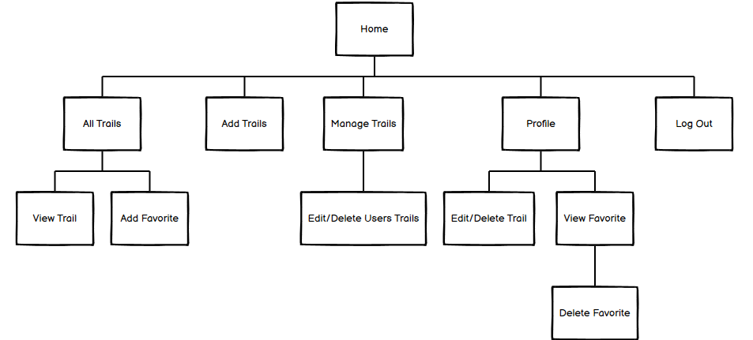
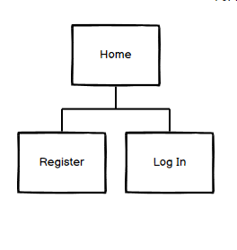
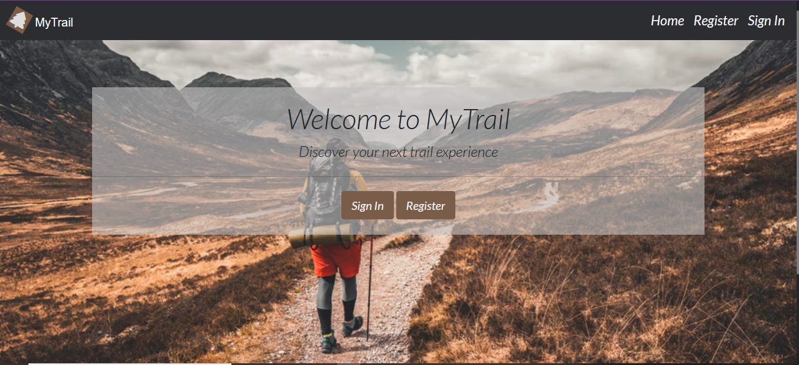
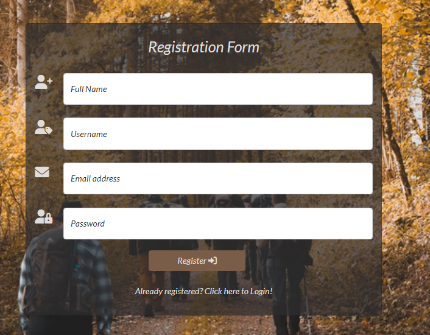
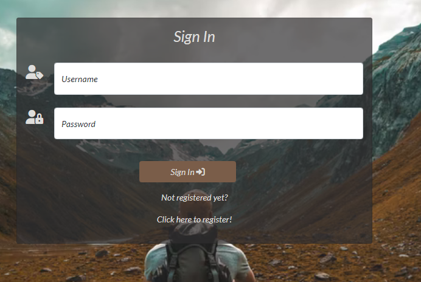
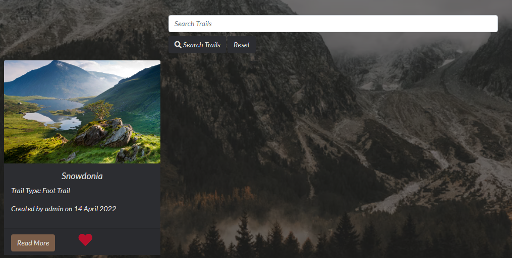
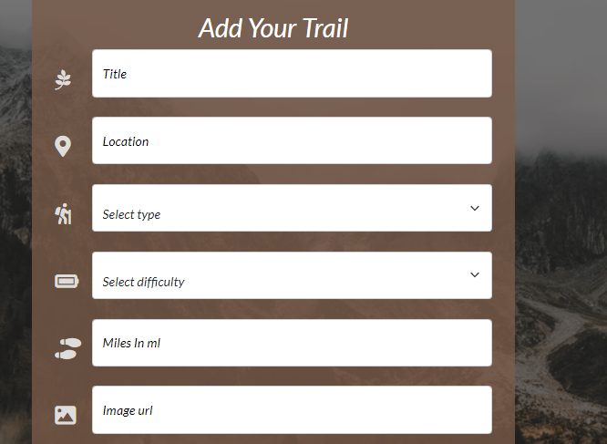
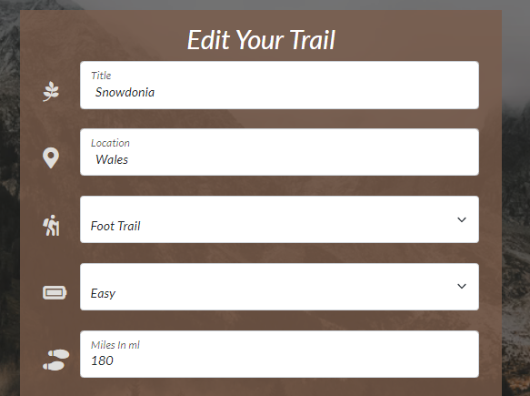
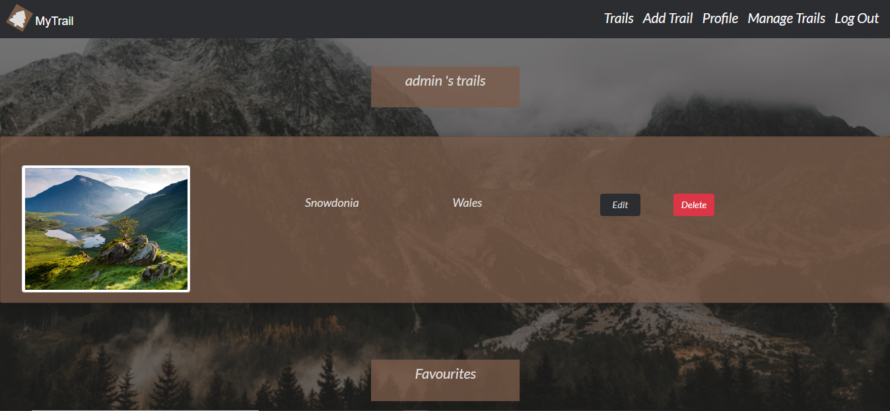
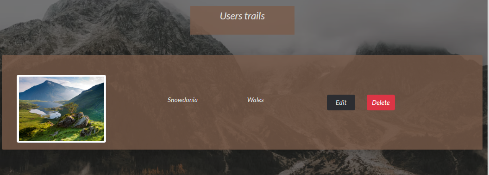

<h1 align ="center">MyTrail App</h1>
<h4 align="center">  Backend Development Third Milestone Project. </h4>


This website provides a platform to users who love sharing trail as well as exploring and discovering new trails. As more and more users starting using the service, the website become a free resource. The main goal of this project is a database maintenance attached to a website, with full CRUD (Create, Read, Update and Delete) functionality. The site is designed to be responsive on a range of devices to make it accessible for trail lovers.

## **Contents**

[User Experience (UX)](#user-experience-ux)
* [User Stories](#user-stories)

[Design](#design)
* [Colour Scheme](#colour-scheme)
* [Typography](#typography)
* [Imagery](#imagery)
* [Wireframes](#wireframes)
* [Features](#features)
* [Future Features](#future-features)

[Information Architecture](#information-architecture)
* [Database Design](#database-design)
* [User Collection](#user-collection)
* [Trail Collection](#comic-collection)
* [Favourites Collection](#publishers-collection)

[Technologies Used](#technologies-used)
* [Languages Used](#languages-used)
* [Workspace](#workspace)
* [Version Control](#version-control)
* [Wireframing](#wireframing)
* [Responsive Design](#responsive-design)
* [Site Design](#site-design)
* [Database Design Technologies](#database-design-technologies)
* [Frameworks, Libraries and Others](#frameworks-libraries-and-others)
* [Testing](#testing)

[Deployment](#deployment)
* [Initial Deployment](#initial-deployment)
* [How to Fork it](#how-to-fork-it)
* [Making a Local Clone](#making-a-local-clone)

[Testing and Project Barrier Solutions](#testing-and-project-barrier-solutions)

[Credits](#credits)
* [Code](#code)
* [Content](#content)
* [Media](#media)
* [Acknowledgements](#acknowledgements)

---

## **User Experience (UX)**

### User Stories

#### First Time Visitor Goals

As a first time visitor to this site, a user should be able to:

* Intuitively and easily understand what to do.
* Easily navigate the site, register and hold an account.
* Get visual feedback when an action on the site is completed.
* Be able to view nature trails posted by other users.

#### Returning Visitor Goals

 A Returning Visitor should be able to:

* Log in and out of their account.
* Add their own trail experiences and share them with other users.
* Edit and delete their posted trails.
* View their posts on their profile.
* Add trails as favourites on their profile.
* Search other trails.

#### Admin Goals

As an admin user should be able to:

* Provide to nature lovers a platform where they can share their trail experiences securely.
* Edit and delete other users posts if needed.

[Back to Top](#contents)

---
## **Design**

### Colour Scheme


* This Coloors palette was chosen to include only earth tone colors to make the user feels closer to the nature. The main color is Brown which found everywhere in nature – trees, animals, the soil and perfectly matches with the theme of the website. 

### Typography

* The website uses an easily readable font from [Google Fonts](https://fonts.google.com/specimen/Lato?query=Lato) called Lato used for all the content, buttons and headings. This font was chosen to match with the sense of simplicity and minimalism provided by the nature related website.

### Imagery

* The icons in the site were taken from [font-awesome](https://fontawesome.com/) and used in the forms, logo and cards for styling, emphasizing the costumed fields and impoving the site's readability.
* All the images used were taken from [Unsplash](https://unsplash.com/) which offers royalty free images and were chosen to complement the colour scheme of the website.
- The [Home page](static/images/welcome-image.jpg) show a nice background, visually appealing image and while welcoming the user.
- The [Register page](static/images/register-image.png) has a strong mountain background image and make the site inviting.
- The [Login page](static/images/singIn-image.png) has an other beautiful nature scened image making the site welcoming for the user.
- The rest of pages, used [hero image](static/images/profile-image.avif) as general image background to keep consistency and harmony in terms of web design across the site.


### **Wireframes**

The wireframes were created using [Balsamiq](https://www.adobe.com/uk/products/xd.html) for Desktop, Ipad and Mobile viewport. 


  - [Home](documentation/wireframes/home-page-wireframe.png)
  - [Log In](documentation/wireframes/signIn-page-wireframe.png)
  - [Register](documentation/wireframes/register-page-wireframe.png)
  - [Add/Edit Trail](documentation/wireframes/addTrail-wireframe.png)
  - [Trails](documentation/wireframes/trails-page-wireframe.png)
  - [Profile](documentation/wireframes/profile-page-wireframe.png)
  - [Manage Trails](documentation/wireframes/admin-page-wireframe.png) when the user is admin.

## Features

The site website's map is shown below.

* For admin users:
<p float="center">
  
    </p>
* For users logged in: 
 <p float="center">
  
    </p>

* For users logged out: 

  
    </p>

--- 
 
 
 **Home Page**
 - User can choose pressing register or login button
     

 **Register Page**
 - Form requesting the user register with their name, address, username and password.
    * 
   
 **Login Page**
 - Form requesting the user sign in providing their username and password.
  
 
 **Logout Page**
 
**Navigation bar**

The navigation bar changes depending on user status and screen size:

| Nav Link | Logged Out | Logged In (User) | Logged In (Admin) |
|-------|-----|-----|-----|
| Logo | &#9989; | &#9989; | &#9989; |
| Log In | &#9989; | &#10060; | &#10060; |
| Register | &#9989; | &#10060; | &#10060; |
| Add Trails | &#10060; | &#9989; | &#9989; |
| Trails | &#10060; | &#9989; | &#9989; |
| Profile | &#10060; | &#9989; | &#9989; |
| Manage Trails | &#10060; | &#10060; | &#9989; |
| Log Out | &#10060; | &#9989; | &#9989; |

 **Trails Page**
 
 
- Welcome
    - Flash message at the top of the page gives feedback that register is successful or `Welcome <users first name>` in case their are already signed users.
- View Trails
    - Trails experiences written by other users, including title and username whom was created be. Button for read more details, activates a modal which show more details for the trail such as type, description, miles, image_url, difficulty, location.
    
- My Favourites
    - User can click on the heart icon and save the trail as favourite.
- Search Bar
  - The search bar allows the user to search by trail name and description so they can find more trails based on their interests. Search and reset buttons present for easy use. 

 **Add Trails**
 
 <p float="center">
  
    </p>
 
 - Form
   - Allows user to enter details of the trails including: location, trail name, trail type, difficulty, image url, miles description of trail.
 
 **Edit Trails**
 
 <p float="center">
  
    </p>
 - Form
   - Allows user to edit details of the trails including: location, trail name, trail type, difficulty, image url, miles description of trail.
  
 **Profile Page**
 
 
  - Username
    - On the top of the profile page is written `<usersname> s Profile`, showing whom the website belongs to.
 
  - User's Posts
    - User can view the trails posted and edit or delete them if they want by clicking the corresponding button.
 
 - Favourites
   - Trails chosen as favourites by clicking the heart icon on the trails page, have been saved and displayed on the fabourites field.

 **Manage Trails** - Only seen by admin user
 
  
 
 - Edit trail and Delete Trails
   - Admin can edit or delete any post made by other users.

---

* Confirm trail deletion modal
    * 

---

* Social links that open in a new tab
    * 

---

* 404 Page Not Found
* 500 Internal Server Error
    * 

---

### Future Features
 
In future I would like to implement a few extra features such as:
 
 - To allow users to delete their account.
 - To allow users to comment below other users trails posts.
 - To give the right to admin to delete other users profiles.
 - Allowing a user to upload images from their device.
 - To add a system where the user would be able to find cafe, restaurants and hotel close to the trails.

### Database Design

MongoDB was used to store data for this site in a database, using the collection are described below:


### User Collection

| Title      | Field        | Data Type |
| ---------- | -----------  | --------- |
| users      | _id          | ObjectId  | 
|            | fname        | String    |
|            | lname        | String    | 
|            | email        | String    | 
|            | username     | String    | 
|            | password     | String    | 

### Trails Collection

| Title      | Field    | Data Type |
| ---------- | -------- | --------- |
| Trails     | _id      | ObjectId  |
|            | trail_id| ObjectId  |
|            | type     | String    |
|            | difficulty| String    |
|            | miles    | String    |
|            | location   | String    |
|            | image_url  | String    |
|            | description| String    |

### Favourites Collection

| Title      | Field    | Data Type |
| ---------- | -------- | --------- |
| favourite  | _id      | ObjectId  | 
|            | title_name| ObjectId  |
|            | username  | string  | 

### Types Collection

| Title      | Field        | Data Type |
| ---------- | -----------  | --------- |
| Types      | _id          | ObjectId  |
|            | type_name    | String    |

### Difficulty Collection

| Title      | Field        | Data Type |
| ---------- | -----------  | --------- |
| Difficulty | _id          | ObjectId  |
|            | difficulty_level| String    |


---

## **Technologies Used**

### Languages Used

* [HTML5](https://developer.mozilla.org/en-US/docs/Web/Guide/HTML/HTML5)
* [CSS3](https://developer.mozilla.org/en-US/docs/Archive/CSS3#:~:text=CSS3%20is%20the%20latest%20evolution,flexible%20box%20or%20grid%20layouts.)
* [JavaScript](https://developer.mozilla.org/en-US/docs/Web/JavaScript)
* [Python](https://www.python.org/)

### Workspace

* [Gitpod](https://gitpod.io/) An online IDE linked to the GitHub repository used to build the site.

### Version Control

Version Control was managed by GitHub and Gitpod after pushing commits to Github.

* [GitHub](https://github.com/) First step on GitHub was to clone the Code Institute template by clicking Use This Template and copying to my repository under the name of my project. By clicking Gitpod, my workspace launched there. 
* [Gitpod](https://gitpod.io/) I created various branches and push to master, by using the commands git add <files to be added> , git commit -m <commit message> and  git push.
* [Gitpod](https://gitpod.io/) version control managed by utilizing the Gitpod terminal to add and commit to Git and push to GitHub.

### Wireframing

* [Balsamiq](https://balsamiq.com/) used to create the wireframes of the project.

### Responsive Design

* [Am I Responsive Design](http://ami.responsivedesign.is/) used to check the website's responsiveness.
 
### Site Design
 
* [Favicon.io](https://favicon.io/favicon-generator/)Used to generate a favicon for the website title.
* [Font Awesome](https://fontawesome.com/) used for the icons of the website.
* [Coolers.co](https://coolors.co/a71313-3c3cdf-0f0f0f-ffffff-198754-ffca02) used to choose and generate the colour scheme.
* [Google Fonts](https://fonts.google.com/) used to import _Lado_ font across the site.

### Database Design Technologies

* [MongoDB](https://www.mongodb.com/) used as main database to store site's contents and allow full CRUD functionality.
* [Flask-PyMongo](https://flask-pymongo.readthedocs.io/en/latest/) used to link Python / Flask app with MongoDB.

### Frameworks, Libraries and Others

* [Flask](https://flask.palletsprojects.com/en/2.0.x/) used as web application framework.
* [Jinja](https://jinja.palletsprojects.com/en/3.0.x/) used as full-featured template engine for Python.
* [Bootstrap](https://getbootstrap.com/) was used to create an responsive website.
* [dnspython](https://pypi.org/project/dnspython/) A DNS toolkit for Python to provide access to DNS.
* [Heroku](https://www.heroku.com) used for the site's deployment.
* [Google DevTools](https://developer.chrome.com/docs/devtools/) used to check bugs emerged throughout building the project and site responsiveness.
* [Lighthouse](https://developers.google.com/web/tools/lighthouse/) used to check the site's Performance, Accessibility, Best Practices, and SEO.
* [pip](https://pip.pypa.io/en/stable/) was used to install the required dependancies for this site.

### Testing
 
* [JSHint](https://jshint.com/) used to test and validate JavaScript.
* [PEP8](http://pep8online.com/) used to validate the python syntax.
* [W3C Markup Validation Service](https://validator.w3.org/) used to validate HTML.
* [W3C CSS Validation Service](http://jigsaw.w3.org/css-validator/) used to validate CSS.

[Back to Top](#contents)

---

## **Deployment**
 
 ### Initial Deployment
 
 **Requirements for Demployment**
  * Python, MongoDB account and database as well as Github and Heroku account is needed.

The project was developed using [GitPod](https://gitpod.io/) and pushed to [GitHub](https://github.com/) then deployed on Heroku using these instructions:

 
 1. A requirements.txt file created using command *pip3 freeze --local > requirements.txt*
 2. A .gitignore file created in my repository.
 3. A `env.py` and `__pycache__/` added into my .gitignore file, for the avoidance of any sensitive information being added into the repository.
 4. An env.py file created and added the following information to it, replacing the '## x ##' values with my own values:

        ``` python
        import os

        os.environ.setdefault("IP", "0.0.0.0")
        os.environ.setdefault("PORT", "5000")
        os.environ.setdefault("SECRET_KEY", " ## YOUR SECRET_KEY ## ")
        os.environ.setdefault("MONGO_URI", " ## YOUR MONGO_URI ## ")
        os.environ.setdefault("MONGO_DB", " ## YOUR MONGO_DBNAME ## ")
        ```
   
5. A Procfile created using the terminal command *echo web: python app.py > Procfile* after making sure there was no stray line in the file as this can cause issues during Heroku deployment.
6. Commit and push to Github the new requirements created above.
7. New app created in Heroku by clicking "New" and "Create New App", setting the region to the closest location and giving the project name.
8. On Heroku dashboard "Deplay" clicked and then from "Deployment Method", GitHub selected.
9. Searched for GitHub repo and connected.
10. In dashboard "Settings" needs to be clicked and then "Reveal Config Vars"
11. Config vars need to be set:
Table:

| Key          | Value |
| ------------ |--------- |
| PORT         | 5000 |
| IP           | 0.0.0.0 |
| MONGO_URI    | USER_MONGODB_URI |
| MONGO_DBNAME | USER_MONGODB_NAME |
| Secret_Key   | USER_SECRET_KEY |
 
 13. On the 'Deploy' tab, 'Enable Automatic Deployment' was clicked.
 14. In 'Manual Deploy', 'master' branch was chosen.
 15.'Deploy Branch' was clicked to deploy the app onto the Heroku servers.
 16. Once the app had finished building, 'Open App' to open my site was clicked.
