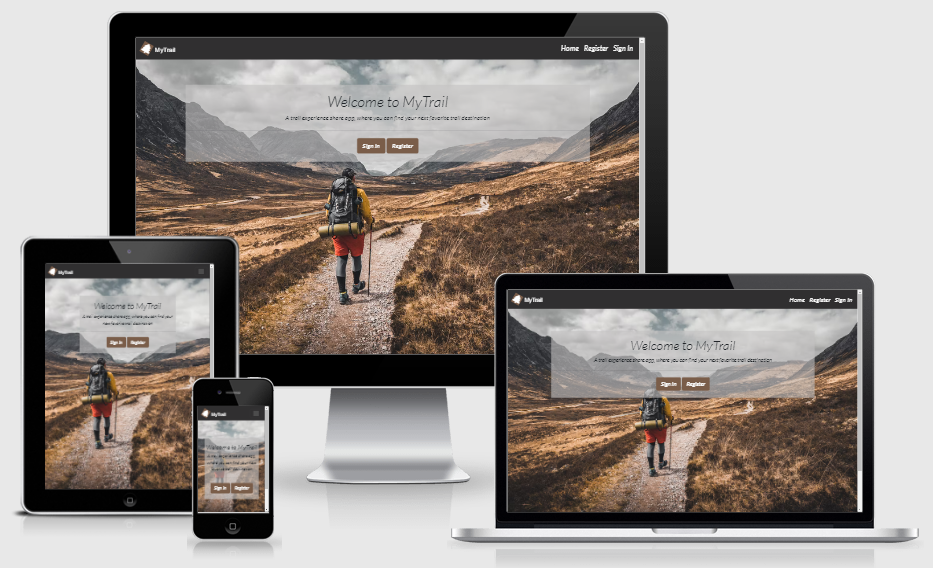
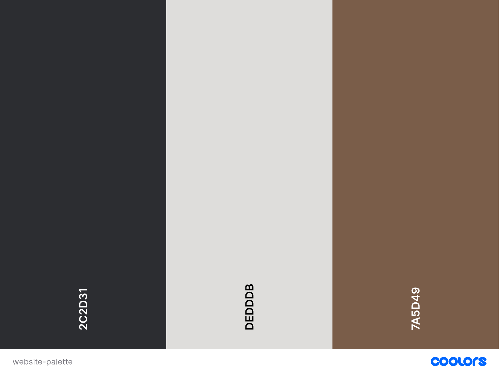

<h1 align ="center">MyTrail App</h1>
<h4 align="center">  Backend Development Third Milestone Project. </h4>

This website provides a platform to users who love sharing trail as well as exploring and discovering new trails. As more and more users starting using the service, the website become a free resource. The main goal of this project is a database maintenance attached to a website, with full CRUD (Create, Read, Update and Delete) functionality. The site is designed to be responsive on a range of devices to make it accessible for trail lovers.

## **Contents**

[User Experience (UX)](#user-experience-ux)
* [User Stories](#user-stories)

[Design](#design)
* [Colour Scheme](#colour-scheme)
* [Typography](#typography)
* [Imagery](#imagery)
* [Wireframes](#wireframes)
* [Features](#features)
* [Future Features](#future-features)

[Information Architecture](#information-architecture)
* [Database Design](#database-design)
* [User Collection](#user-collection)
* [Comic Collection](#comic-collection)
* [Publishers Collection](#publishers-collection)

[Technologies Used](#technologies-used)
* [Languages Used](#languages-used)
* [Workspace](#workspace)
* [Version Control](#version-control)
* [Wireframing](#wireframing)
* [Responsive Design](#responsive-design)
* [Site Design](#site-design)
* [Database Design Technologies](#database-design-technologies)
* [Frameworks, Libraries and Others](#frameworks-libraries-and-others)
* [Testing](#testing)

[Deployment](#deployment)
* [Requirements for Deployment](#requirements-for-deployment)
* [Initial Deployment](#initial-deployment)
* [How to Fork it](#how-to-fork-it)
* [Making a Local Clone](#making-a-local-clone)

[Testing and Project Barrier Solutions](#testing-and-project-barrier-solutions)

[Credits](#credits)
* [Code](#code)
* [Content](#content)
* [Media](#media)
* [Acknowledgements](#acknowledgements)

---

## **User Experience (UX)**

### User Stories

#### First Time Visitor Goals

As a first time visitor to this site, a user should be able to:

* Intuitively and easily understand what to do.
* Easily navigate the site, register and hold an account.
* Get visual feedback when an action on the site is completed.
* Be able to view nature trails posted by other users.

#### Returning Visitor Goals

 A Returning Visitor should be able to:

* Log in and out of their account.
* Add their own trail experiences and share them with other users.
* Edit and delete their posted trails.
* View their posts on their profile.
* Add trails as favourites on their profile.
* Search other trails.

#### Admin Goals

As an admin user should be able to:

* Provide to nature lovers a platform where they can share their trail experiences securely.
* Edit and delete other users posts if needed.

[Back to Top](#the-collector)

---
## **Design**

### Colour Scheme

* This Coloors palette was chosen to include only earth tone colors to make the user feels closer to the nature. The main color is Brown which found everywhere in nature – trees, animals, the soil and perfectly matches with the theme of the website. 

### Typography

* The website uses an easily readable font from [Google Fonts](https://fonts.google.com/specimen/Lato?query=Lato) called Lato used for all the content, buttons and headings. This font was chosen to match with the sense of simplicity and minimalism provided by the nature related website.

### Imagery

* The icons in the site were taken from [font-awesome](https://fontawesome.com/) and used in the forms, logo and cards for styling, emphasizing the costumed fields and impoving the site's readability.
* All the images used were taken from [Unsplash](https://unsplash.com/) which offers royalty free images and were chosen to complement the colour scheme of the website.
- The [Home page](static/images/welcome-image.jpg) show a nice background, visually appealing image and while welcoming the user.
- The [Register page](static/images/register-image.png) has a strong mountain background image and make the site inviting.
- The [Login page](static/images/singIn-image.png) has an other beautiful nature scened image making the site welcoming for the user.
- The rest of pages, used [hero image](static/images/profile-image.avif) as general image background to keep consistency and harmony in terms of web design across the site.
