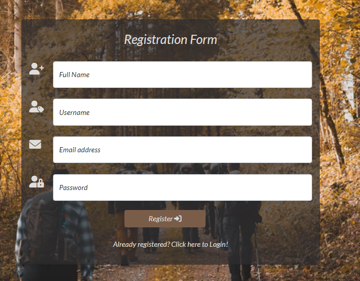
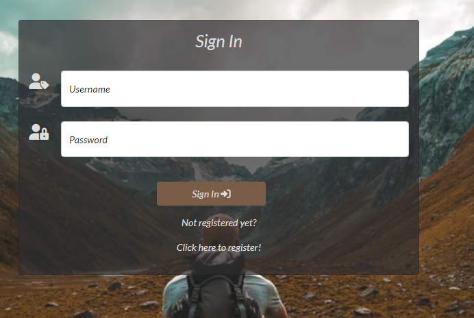
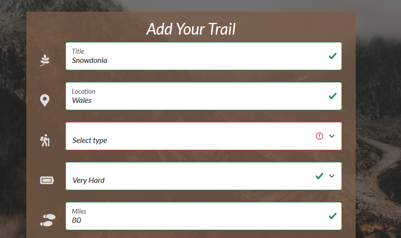

# **Testing And Project Bugs**

## **Contents**

[Testing User Stories](#testing-user-stories)

[Code Validation](#code-validation)

[Responsiveness](#responsiveness)

[Testing Performance](#testing-performance)
* [Lighthouse](#lighthouse)

[Project Barriers and Solutions](#project-barriers-and-solutions)
* [Fixed Bugs](#fixed-bugs)
* [Known Bugs](#known-bugs)

---

## **Testing User Stories**

### **First Time Visitor**

**Intuitively and easily understand what to do.**
- All buttons are clearly labelled and have a descriptive text.
- Navbar, headers and modals and links presented clearly to users.

  
  
  
  
  

    
 **Easily navigate the site.**
    
 - Navbar provides users an easy navigation through the website, by clicking the relevant page they want to access, without errors.
 - Navbar displayed differently depending on what access the user has. (logged in, logged out, admin)
 - Navbar is responsive accross all screen sizes and turns to burger icon when it comes to mobile size.
 
 
    
    
    
    
    
  
    
**Register for an account.**
    
 - Register page is visible on navbar only for the logged out users.
 - Register form is easy to follow and clear.
    
  
    
 **Get visual feedback when an action on the site is completed.**
    
 - User immediately gets a flash message, feedback response, after completing an action on the website.
    
 

  
  
  
  
   
  

 
  

     
  #### Returning Visitor Goals
  
**Log in and out of their account.**
    
 - The Sign In page is visible for the users who aren't logged in and Log Out button on Navbar is visible for the logged in users.
  
 
   
   
   

    
**Add their own trail experiences and share them with other users**
    
- User can add trail through a link on the navbar, a button on their profile page, a link on the navbar, as well as a button on the add form.
- While filling the add form in, validation messages appeared to user, if they enter the correct or incorrect format of information or skip required fields.
   
 
  
  
    

**Edit and delete their posted trails**
- Users can edit their trails through the relevant button on their profile, which is linked with the edit form.
    
  
  
    
**View their posts on their profile**
  - After posting a trail users can return back to their profile, to view, edit or delete it.
   
   
 **Add trails as favourites on their profile**
  - User can click on the heart icon appears on the bottom of the trails cards and save them as favourites.
  - Users can see all the saved favourite trails on their profile.
  - Filled heart icon means that the trail has been click as favorite and added to favourite field on profile while outlined heart icon means it hasnt been added yet to favorites.
    
    
    
   
    
**Search other trails**
- Users can view all the trails have been posted by other users and search by trail title and any word included on "description".
  
    
### **Admin User**
    
  **Provide to nature lovers a platform where they can share their trail experiences securely**
  - All user passwords are encrypted by using the generate_password_hash library which provides hashed passwords and gives extra security to login accounts. 
    
    
 **Edit and delete other users posts if needed**
  - Admin can delete and edit any post of the app.
    
  
 
#### Code Validation
 
 ### W3C Markup Validation Service:

The [W3C Markup Validation Service](https://validator.w3.org/) was used to validate the HTML of the website and returned no errors.

Results below:-

* The myTrail full website:
  

* Home Page:
 

* Registration Page:

* Log In Page:

* Profile Page:

* Trails Page:

* Add Trail Page:

  
* Edit Trail Page:

    
* Manage trails Page  (only for admin):

* 404 Page:
    * 
    

The CSS file was tested with [W3C CSS Validation Service](http://jigsaw.w3.org/css-validator/).

* CSS Validation Results:
  

---
    
All javascripts files were tested with [JSHint](https://jshint.com/). 

* _script.js_ File Results:
  
   

* _like_icon.js_ File Results:
   
    
### Python 8:

The python file was run through [PEP8](http://pep8online.com/).

* PEP8 Results:
    

[Back to Top](#testing-and-project-barrier-solutions)

---
 ### Responsiveness

Responsiveness tested  across different screen sizes and browsers. More specifically, Dev Tools used to emulate the following devices:

**Mobile Devices**
- Galaxy S5
- Galaxy S9
- iPhone 5/SE
- iPhone 6/7/8
- iPhone 6/7/8 plus
- iPhone X / XS

**Tablet Devices**
- iPad
- iPad Pro

**Browsers**
- Google Chrome
- Mozilla Firefox
   
 
    
 ## **Testing Performance**

### Lighthouse
Google Lighthouse checked different pages and returned different results. Most of the errors thrown was relating to the images size, types, as well as missing attributes and unnecessary classes removal. All the pictures compressed by  and been replaced on the site.

 * Home
   

     
    

  
* Add Trails Page 
  

     
   

    
* Trails Page
 

[Back to Top](#testing-and-project-barrier-solutions)

---

## **Project Barriers and Solutions**

### Fixed Bugs
    
  - On the bottom of each trail cards, there is a heart icon, which toggle classes by using Javascript Event Listener and changes icon when it's clicked. A bug found when the new class set by clicking couldn't remain οn the card after refreshing the page. Thus, I had to fix that manually on app.py by looping into trails and favourites collection and give a specific class for the icon, if the trail_id and favourites_title_name were same. That prevents the icon from changing after refreshing the page. 

- An other bug I came across with was that the like button didn't render on trail cards after clicking the search button on the search bar. The bug solved by looping through the trails and favourites collection, finding if the current user's favourites trails existing in the trails collection that were just searched and then render the heart icon accordingly. 
    
 

 
 
    

    
- While this project was building, Heroku made updates that caused significant problems and failures on deployment especially for those had an app created which used automatic deploys from Github to Heroku. As a result all the deployments had to be done manually form the terminal running the commands: 
*heroku login -i*  
*heroku git:remote -a your_app_name_here*
*git push heroku main* 
    

### Known Bugs

* There are no known errors.
   

